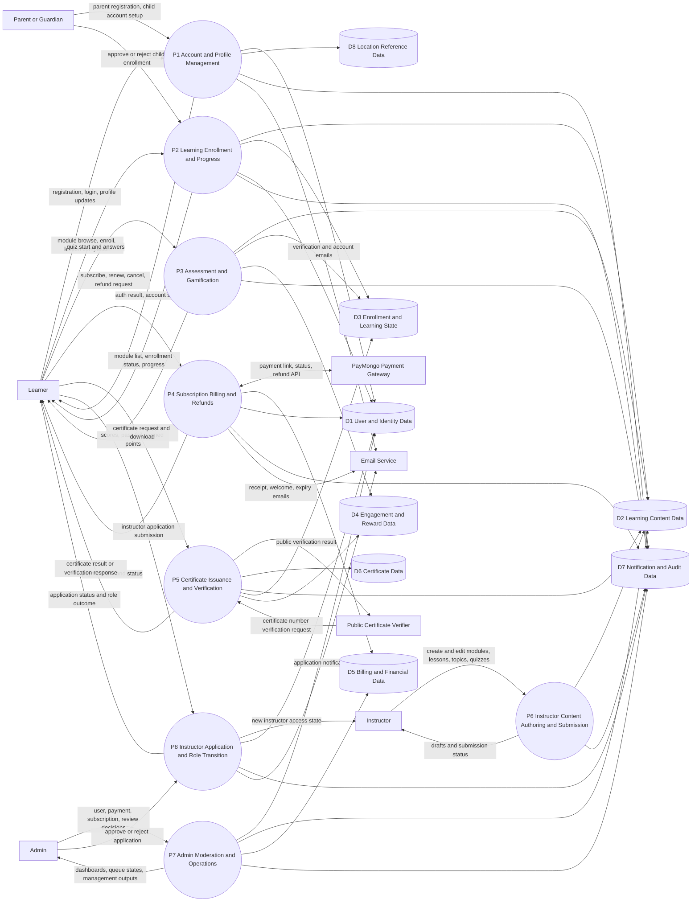

# Concious Connections - Level 1 Data Flow Diagram (DFD)

## Scope
This Level 1 DFD represents the current implemented system for the Sex Education Learning Platform, Concious Connections, based on active routes, controllers, services, models, and migrations.

It captures the major interactions among learners, instructors, admins, and the platform, including supporting external systems.

## External Entities
- E1 Learner
- E2 Instructor
- E3 Admin
- E4 Parent/Guardian
- E5 PayMongo Payment Gateway
- E6 Email Service (SMTP provider)
- E7 Public Certificate Verifier

## Main Processes (Level 1)
- P1 Account, Authentication, and Profile Management
- P2 Learning Access, Module Enrollment, and Progress Tracking
- P3 Assessment and Gamification Processing
- P4 Subscription, Payment, and Refund Processing
- P5 Certificate Issuance and Verification
- P6 Instructor Content Authoring and Submission
- P7 Admin Moderation and Platform Operations
- P8 Instructor Application and Role Transition

## Data Stores
- D1 User and Identity Data
  - users, learner_profiles, instructor_profiles, parent_child_accounts, role/permission mappings
- D2 Learning Content Data
  - modules, lessons, lesson_topics, quizzes, quiz_questions, quiz_options, module_revisions, module_review_requests
- D3 Enrollment and Learning State Data
  - module_enrollments, user_progress, lesson_topic_progress, quiz_attempts
- D4 Engagement and Reward Data
  - user_gamifications, user_daily_shields, achievements, rewards_logs
- D5 Billing and Financial Data
  - subscribers, subscription_plans, plan_prices, payments, refunds, invoices, feature_catalog, plan_feature_entitlements
- D6 Certificate Data
  - certificates
- D7 Notification and Audit Data
  - notifications, activity_logs, admin_activity_logs
- D8 Location Reference Data
  - regions, provinces, cities, barangays

## Level 1 DFD (Mermaid)

## Data Flow Catalog (Condensed)
1. Learner account and profile flow: Learner submits registration/profile data to P1, which writes identity and profile records to D1 and references D8 for location validation.
2. Parent-child supervision flow: Parent creates child accounts through P1 and approves/rejects enrollment requests through P2, updating D1 and D3.
3. Learning flow: Learner requests modules and lessons through P2, which reads D2 and writes enrollment/progress states in D3.
4. Assessment flow: Learner sends quiz answers to P3; P3 reads quiz definitions from D2, stores attempts in D3, updates rewards in D4, and returns results.
5. Billing flow: Learner actions trigger P4, which creates and updates subscriber/payment/refund records in D5 and exchanges payment/refund data with E5.
6. Certificate flow: P5 checks completion and quiz outcomes from D3 and content context from D2, writes certificate records in D6, and provides verification responses to E7.
7. Instructor authoring flow: Instructor submits content changes through P6, which persists draft/review payloads in D2 and emits review activity to D7.
8. Moderation flow: Admin executes review and platform management via P7, reading and updating D1, D2, D5, and D7.
9. Instructor application flow: Learner submits application in P8; admin decision updates role transition and application state in D1, logs in D7, and sends notifications via E6.

## Notes for Documentation
- This is a Level 1 logical DFD, so it groups detailed controller/service actions into major business processes.
- Queue-based jobs (invoice generation, email dispatch) are represented as process outputs to E6 and writes to D5 or D7.
- Legacy and backward-compatible routes are absorbed into the same process groups where behavior is functionally equivalent.
